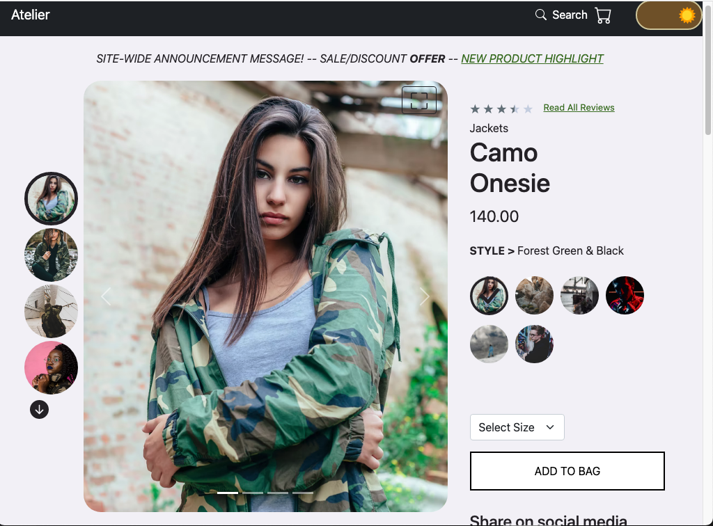
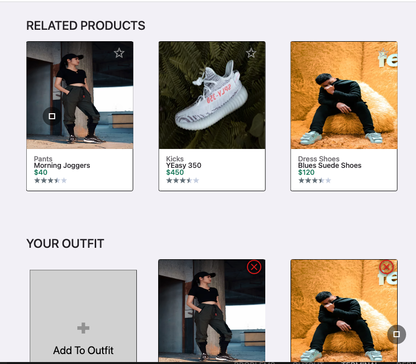
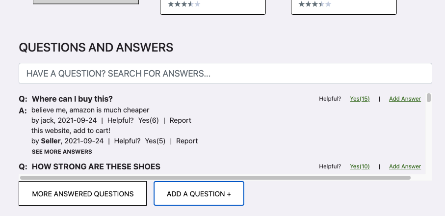
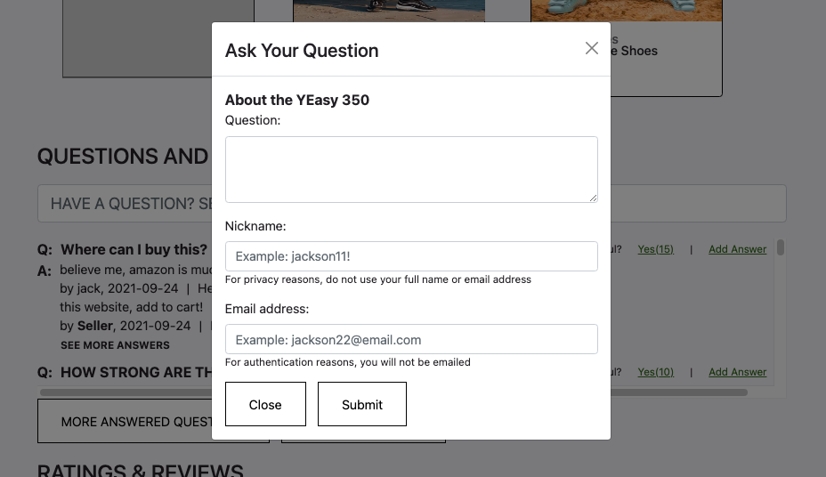
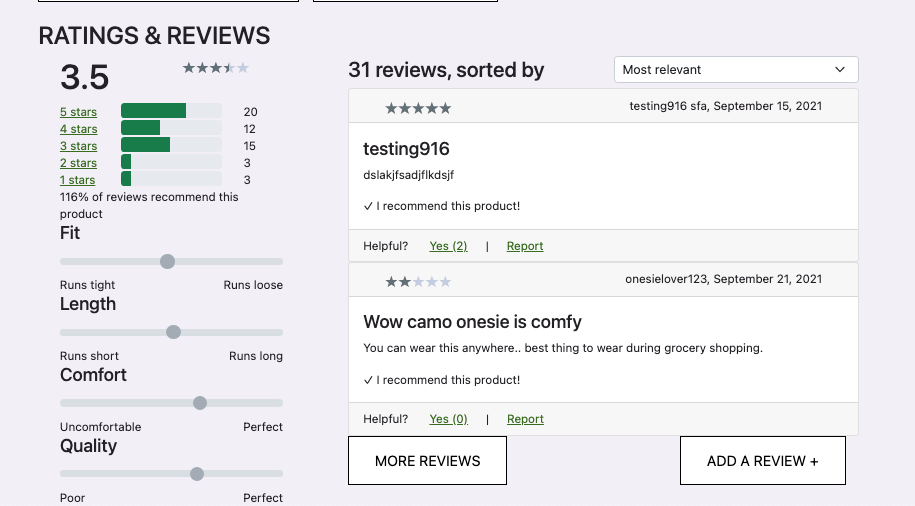
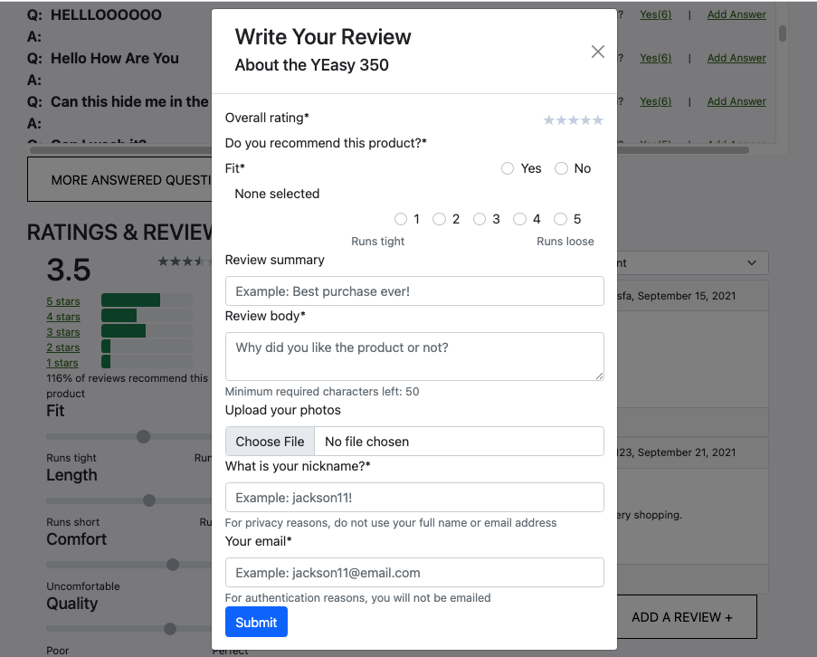

# Atelier  [Demo](https://project-atelier.herokuapp.com/)

## Overview

Atelier (Project Catwalk) is a MVP retail e-commerce client for browsing catalog products with a modern customer experience. This frontend project is built to serve product records from an external API. This was a group project with a group of 4 engineers, each working on one the of the four modules (see [Features](#features)) over a span of two weeks.


## Contributors

- [Andy Chen](https://github.com/andy-ch3n) ([LinkedIn](https://www.linkedin.com/in/andych3n/))
- [Gabrielle Guo](https://github.com/ggbbi) ([LinkedIn](https://www.linkedin.com/in/ggbbi/))
- [Lawrence Sun](https://github.com/lawsun03) ([LinkedIn](https://www.linkedin.com/in/lsun0/))
- [Spencer Lepine](https://github.com/spencerlepine) ([LinkedIn](https://www.linkedin.com/in/spencer-lepine/))

## Setup

```sh
cp config.example.js config.js
npm install
npm run build
npm start # new window
```

## Tech Stack

- [React](https://reactjs.org/)
- [React-Bootstrap](https://react-bootstrap.github.io/)
- [Styled Components](https://styled-components.com/)
- [Webpack](https://webpack.js.org/)
- [Express](https://expressjs.com/)
- [Node.js](https://nodejs.org/en/)
- [Jest](https://jestjs.io/)
- [React Testing Library](https://testing-library.com/docs/react-testing-library/intro/)
- [Google Lighthouse](https://developers.google.com/web/tools/lighthouse)

## Features

This project was broken down into four modules: Products Overview, Related/Outfit, Question/Answers, and Rating/Reviews. The entire group worked together to build a minimal Express server forwarding requests to an external (pre-built) products API. There was also collaboration to implement a light/dark theme with dynamic styling.

### Products Overview

- View and scroll through product display images.
- See details like ratings, sales price, and available item styles.
- Select a size to be added to the cart.



### Related and Outfit

- Click on a card body to open that product in the overview section.
- Related: see products similar to the product currently displayed in the "overview" modules.
- Related: Click the star button to open the comparison modal.
- Outfit: carousel view for a personal outfit list of saved products
- Outfit: remove or add products to list (stored in browser local storage)



### Question and Answers

- View/search product questions with feedback
- Submit questions in a pop-up form
- Answer questions in a pop-up form




### Rating and Reviews

- Product rating breakdown
- Sort product ratings
- Write your review in a pop-up form




## External API Documentation

- [Atelier API](https://gist.github.com/trentgoing/d69849d6c16b82d279ffc4ecd127f49f)
